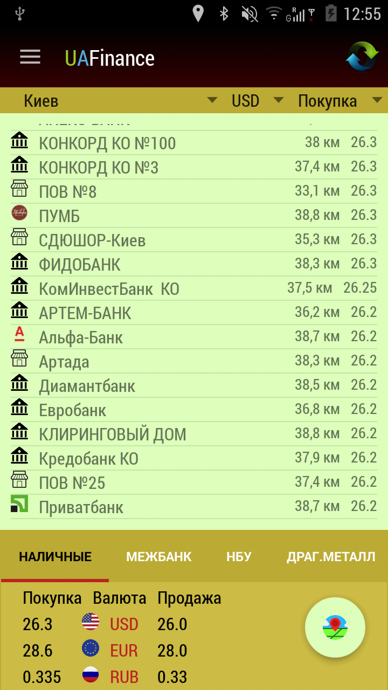
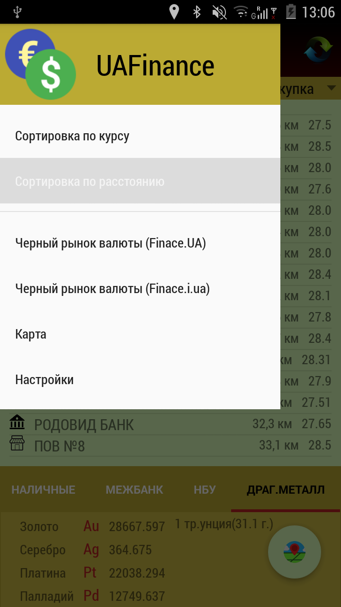
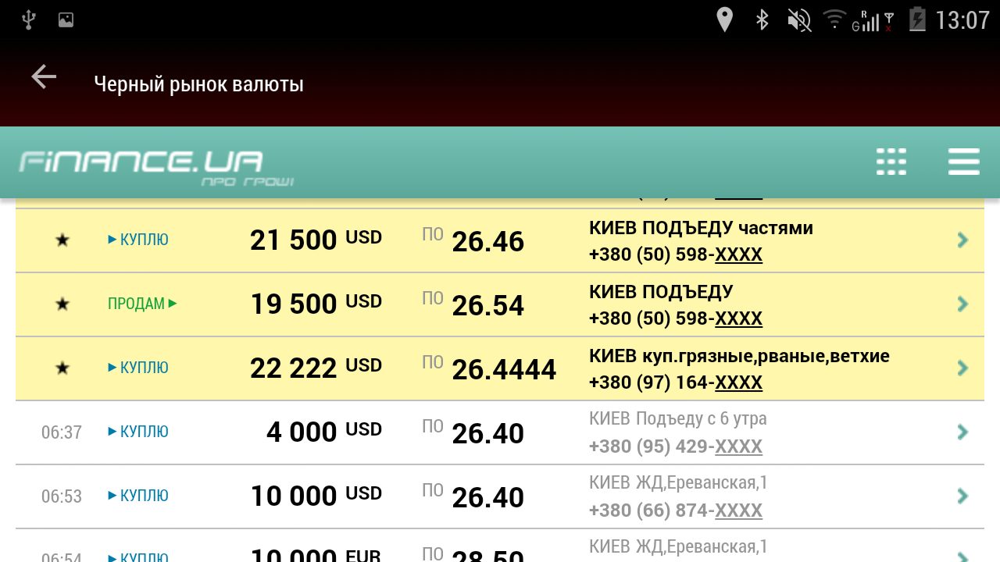
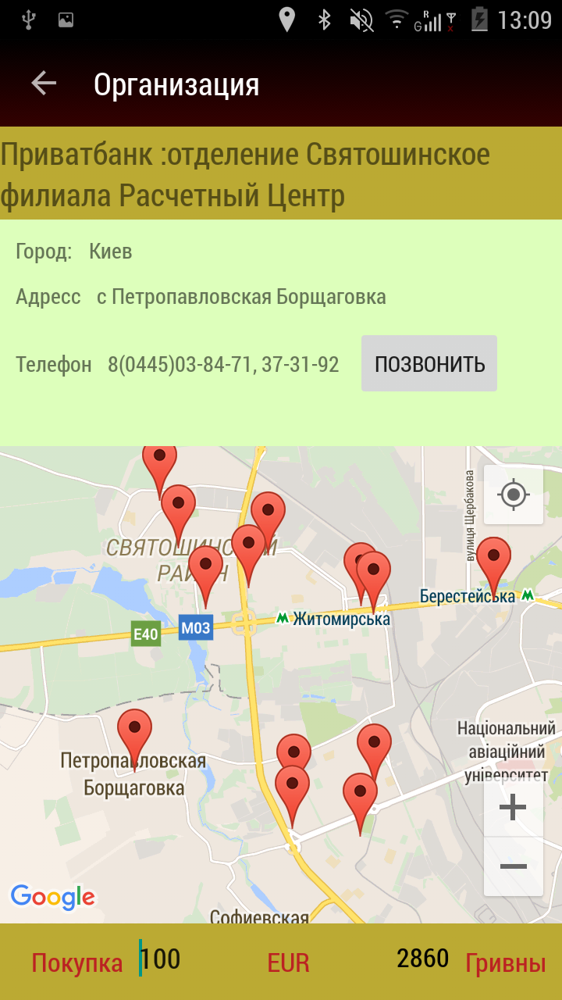
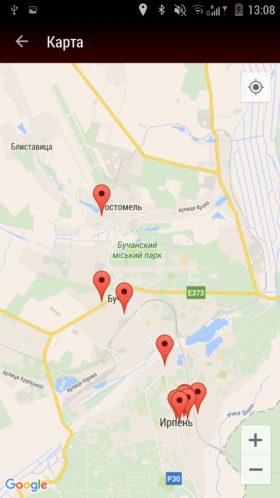
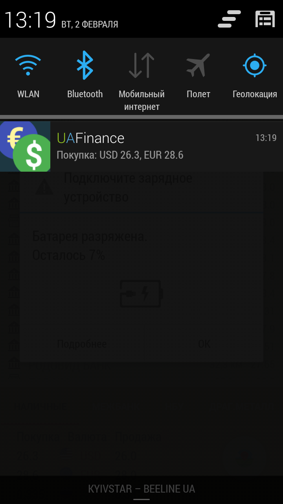

# UAFinance
Application for Android for quick &  easy search  of the nearest currency exchange with the best rate.
The application gets finance datas from Net and provides the user, sorted by course or by distance. 
Also, the application provides information about rate of National Bank Ukraine, the InterBank and courses of precious metals. 
Application is available on Yandex Store, and now is preparing for publication on Google PlayMarket.

In the application I used Goole MAP API, LocationManager, FragmentViewPAger, AlarmManager, Services, BroadcastReciver(with start On Boot Device), AsyncTask,
HttpURLConnection, NavigationView, Handlers, FloatingActionButton, DrawerLayout, Animation, WebView, GSON, JACKSON, XmlPullParser, PreferenceFragment.
  
Main Screen  

Navigation View

The application provides information about black market currency exchange
Black Market

The application provides all the contact information of banks and their branches. The application also provides a currency calculator.

Map displaying all nearby exchangers.

The application every day inform the user about the current courses and indicates if courses was jump using Notification.

To-Do

1) Increase the database of banks and exchangers, with the optimization of its update rate.
2) A widget for desktop.
3) Optimization time of first start.

  
